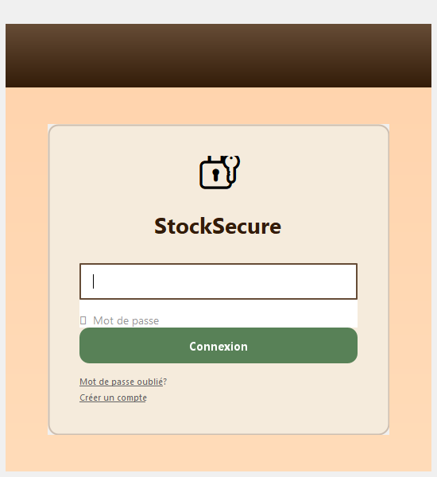
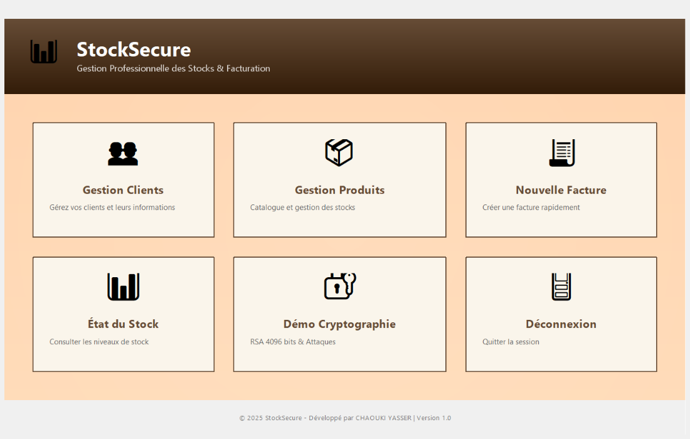
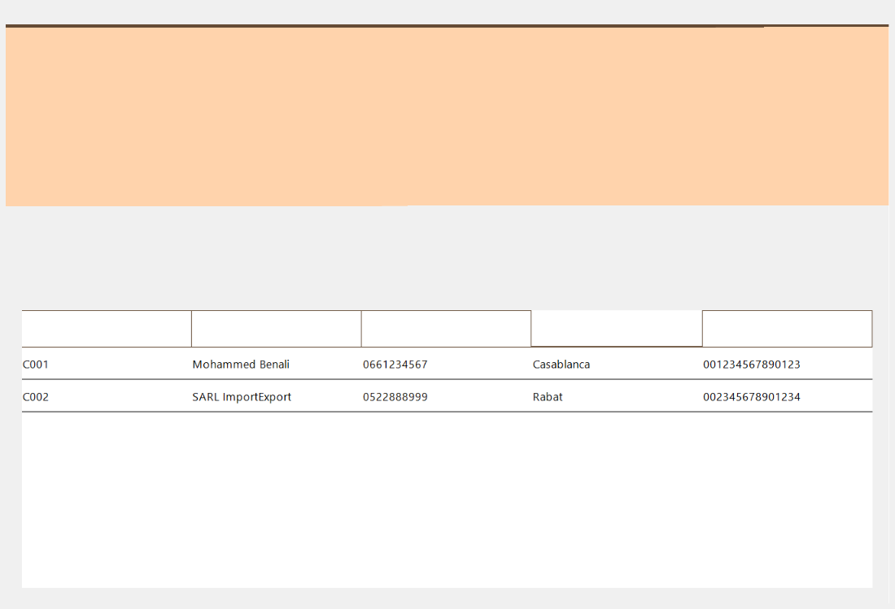
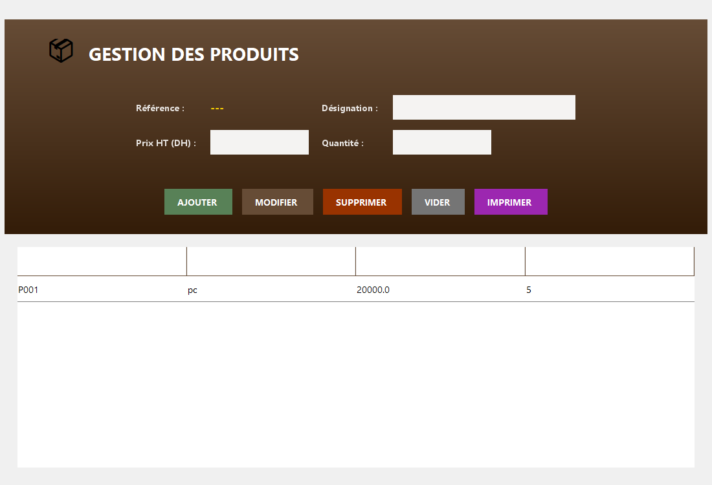
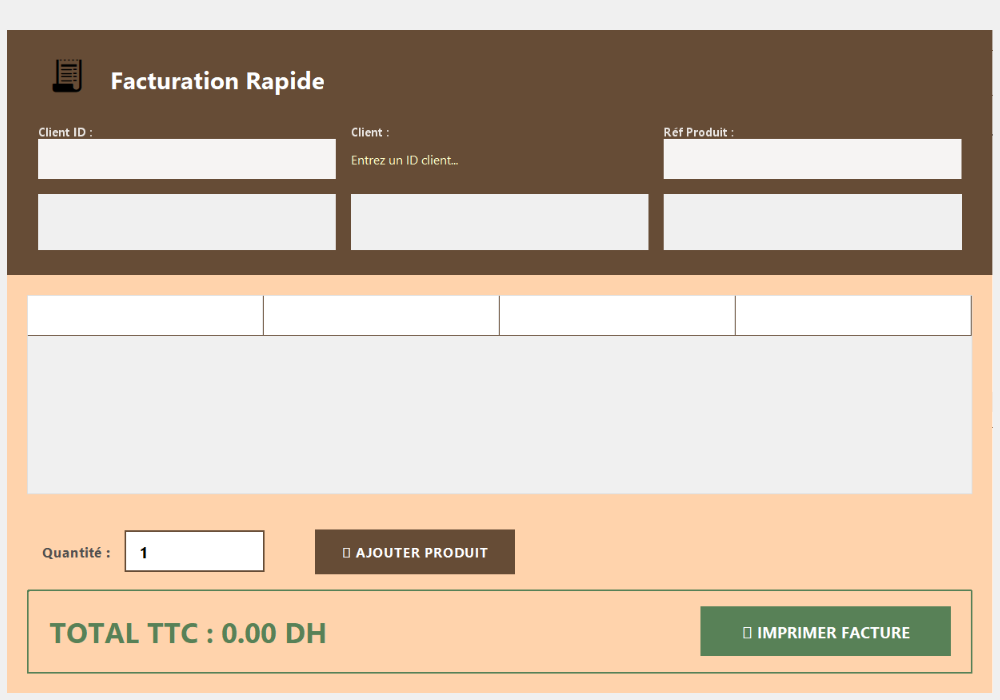
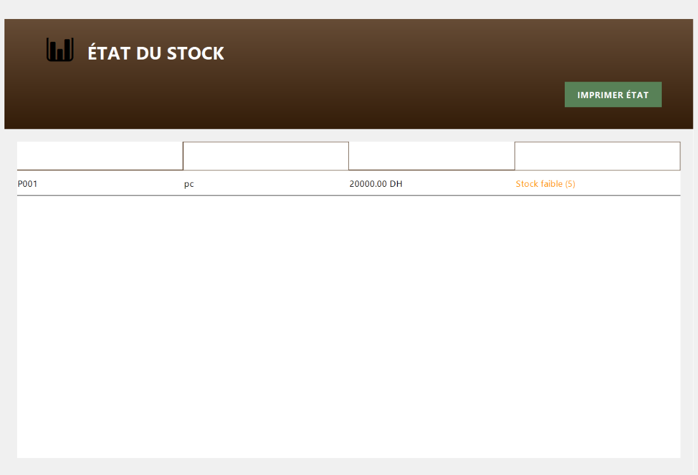

# StockSecure

StockSecure est une application de bureau moderne pour la gestion des stocks et la facturation, développée en Java avec une interface utilisateur Swing élégante utilisant des tons terre chauds.

## Description

Cette application permet aux entreprises de gérer efficacement leurs stocks, clients, produits et factures. Elle offre une interface intuitive avec un système d'authentification sécurisé, une configuration initiale simple, et des modules dédiés pour chaque aspect de la gestion d'inventaire.

## Fonctionnalités

- **Système d'authentification** : Connexion sécurisée avec création de compte administrateur lors du premier lancement
- **Tableau de bord** : Interface principale avec accès rapide à toutes les fonctionnalités
- **Gestion des clients** : Ajout, modification et suppression des informations clients
- **Gestion des produits** : Catalogue des produits avec suivi des niveaux de stock
- **Création de factures** : Génération rapide de factures avec calcul automatique des totaux
- **État du stock** : Consultation en temps réel des niveaux de stock et alertes
- **Démonstration cryptographique** : Module avancé montrant RSA 4096-bits et attaques cryptographiques

## Captures d'écran

### Écran de connexion


### Tableau de bord


### Gestion des clients


### Gestion des produits


### Création de facture


### État du stock


## Installation et Exécution

### Prérequis
- Java Development Kit (JDK) 8 ou supérieur
- Système d'exploitation Windows, macOS ou Linux

### Instructions d'installation
1. Téléchargez ou clonez le projet depuis le dépôt
2. Assurez-vous que le JDK est installé sur votre système
3. Compilez l'application :
   ```
   javac -d bin src/ma/project/*.java
   ```
4. Créez le fichier JAR exécutable :
   ```
   jar cfm StockSecure.jar manifest.txt -C bin .
   ```

### Exécution
- Double-cliquez sur `StockSecure.jar` ou exécutez :
  ```
  java -jar StockSecure.jar
  ```

### Premier lancement
Lors du premier lancement, l'application vous guidera pour créer un compte administrateur. Les identifiants seront sauvegardés dans `config.txt`.

## Technologies Utilisées

- **Java** : Langage de programmation principal
- **Swing** : Framework pour l'interface graphique
- **AWT** : Pour les composants graphiques avancés
- **Cryptographie RSA** : Implémentation personnalisée pour la démonstration

## Auteur

Développé par CHAOUKI YASSER

## Licence

© 2025 StockSecure - Version 1.0
